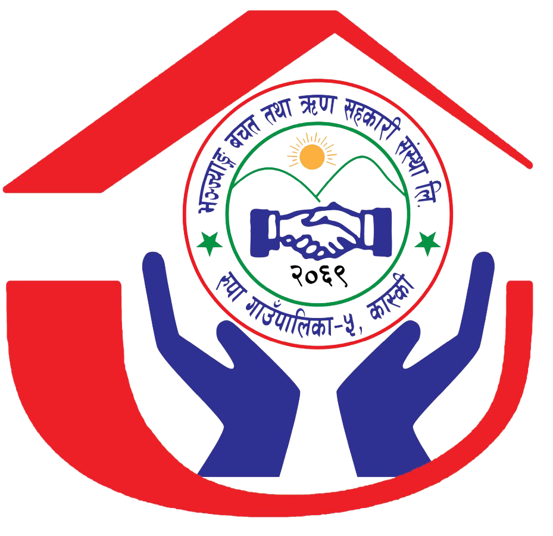

# Bhanjyang Cooperative – bhanjyang.coop.np

A premium, member-owned cooperative website built with **Django**. Features a modern glassmorphic design, responsive layouts, and smooth scroll animations.



## Features

-   **Modern Design**: Glassmorphism effects, gradient backgrounds, and refined typography (Outfit & DM Sans).
-   **Animations**: **AOS (Animate On Scroll)** integration for dynamic element entrance (fade-up, zoom-in).
-   **Responsive**: Fully optimized for mobile, tablet, and desktop.
-   **Core Pages**: Home (with Hero, Stats, Features, Testimonials), About, Services, News, Contact (currently linked to `Coming Soon`).
-   **Robust Error Handling**: Custom `404` (Not Found) and `500` (Server Error) pages matching the site theme.

## Run Locally

**1. Setup (once):**

```bash
git clone https://github.com/your-username/bhanjyang-website.git
cd bhanjyang-website
python3 -m venv venv
source venv/bin/activate   # Windows: venv\Scripts\activate
pip install -r requirements.txt
```

**2. Configure Environment:**
Create a `.env` file in the project root:
```env
DEBUG=True
SECRET_KEY=your-local-secret-key
ALLOWED_HOSTS=localhost,127.0.0.1
```

**3. Start Server:**
```bash
python manage.py runserver
```
Visit **http://127.0.0.1:8000**

## Project Structure

```
website/
├── manage.py
├── requirements.txt
├── .env                    # Environment variables (gitignored)
├── config/                 # Core settings & URLs
├── static/                 # Global Static Files
│   ├── css/styles.css      # Main stylesheet (Glassmorphism, Variables)
│   ├── js/script.js        # Logic for Nav, Scroll, AOS, Counters
│   └── images/
├── templates/              # Global Templates
│   ├── base.html           # Base layout
│   ├── 404.html            # Custom Error Page
│   ├── 500.html            # Custom Server Error Page
│   ├── coming_soon.html    # Placeholder Page
│   └── partials/           # Header & Footer Components
└── apps/
    └── home/               # 'Home' App
        └── templates/home/
            └── index.html  # Landing Page
```

## Deployment

Refer to [DEPLOYMENT.md](DEPLOYMENT.md) for a step-by-step guide to deploy on Babal Host (Nepal, cPanel).

**Quick Checks:**
-   Ensure `DEBUG=False` in production.
-   Use a strong `SECRET_KEY`.
-   Configure `ALLOWED_HOSTS` properly.

